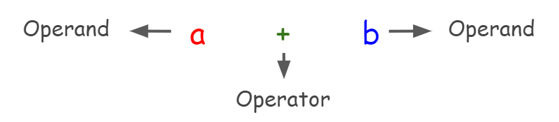

# Operators

> “Computers are better than we are at arithmetic, not because computers are so good at it, but because we are so bad at it.” - Isaac Asimov.<br><br>
> "Oof" - Quote Reader.

**Outline**

- Operators vs Operands
- Unary Operators
- Binary Operators
- Ternary Operators
- Heirarchy Table.

## Operators vs Operands

Let's get the formal defination out of the way.

- Operator performs some mathematical or logical operation on the operand.
- Operand is the variable/ constant on which the operator is operating.

Example, please?

<div align="center" style="padding: 2rem;">
	
</div>

Here, in the expression, **a + b**, **+** is denoted as an operator in programming because it performs a mathematical operation (addition) on the elements **a** and **b** which are therefore called operands. Depending upon the number of operands, we have - Unary, Binary and Ternary operators.

## Unary Operators

- Always acts on a single operand.
- **++** (unary increment operator) increases the value by 1 and **--** (unary decrement operator) decreases the value by 1.
- They are called prefix or postfix depending on whether they are placed before or after the operand.

<div align="center" style="padding: 2rem;">
	
</div>

### Difference between prefix and postfix

The keyword to remember in prefix operations is **change before use** and in postfix operations is **change after use**. For example -

```C
int a = 3;
int b = ++a;  /* The value stored in b will be 4, because first the value of a is incremented
				from 3 to 4 (change before use) and then it is assigned (used) to b*/
int c = a++;  /* The value stored in c will be 4 (current value of a is 4 as it was incremented
                when assigned to b), because first the value of a is assigned (used) to c and
				then it is incremented from 4 to 5 (change after use).*/
int d = a;    // Since the current value of a is 5, the value stored in d will be 5.
```

For a more visual example, refer [here](https://www.youtube.com/watch?v=FALus1PqmM8), timestamp 2:42 - 7:00.

## Binary Operators

Always act on two operands. Its different types are -

### Arithmetic Operators

- These operators perform a mathematical operation on the operands.
- They are : + - \* / %

```C
int add = 5 + 2; // 7 due to addition
int sub = 5 - 2; // 3 due to substraction
int mul = 5 * 2; // 10 due to multiplication
int div = 5 / 2; // 2 not 2.5, since division between two integers produces an integer
float div_float = 5.0 / 2.0 // 2.5 since the operands are floating points
int rem = 5 % 2; /* 1 since it is the remainder when 5 is divided by 2. The modulo operator
					only works on integer operands beacause of the following equation being
					generated when you divide one number with another :
					dividend = quotient*divisor + remainder
					Here all of these are integer values. To find the modulo of floating
					point numbers you need to use fmod() provided in the math library*/
```

### Relational Operators

- These operators find a relationship between the operands.
- The relationships can be : > < >= <= == !=

```C

```

### Logical Operators

&& || !

### Bitwise Operators

& | ^ << >>

## Type Conversions when using operators

## Type Casting
