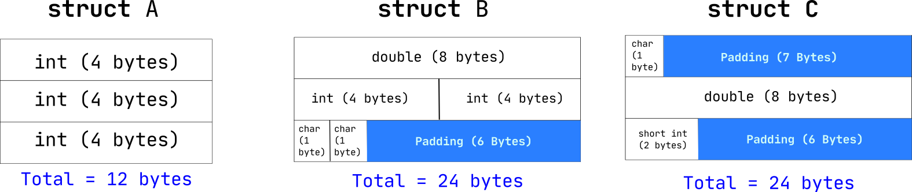

# Structures

**Outline**
* The Idea of Abstraction
* What are structures in C?
* Reading and Writing to a `struct`
* Nesting Structures
* Sizes of Structures
* Arrays of Structures
* `typedef` keyword


## The Idea of Abstraction


## What are structures in C?

Structures are entities in C that can be used to bundle up various data types together. In arrays we saw how to bundle up values of the same type. We use structures when there is a need to represent some **real world** entitity in code. The syntax to declare a structure is pretty straight forward in C.

```C
struct date {
	int date;
	int month;
	int year;
}; // don't miss the ;
```

Here, we declare a structure `date` that has 3 attributes, `date`, `month` and `year`. This `date` structure will act as a blue print that we can use to create objects, each object will have its own set of values for the attributes, to access and modify this data we use the `.` (dot) operator.

```C
#include <stdio.h>

struct date {
	int day;
	int month;
	int year;
};

int main(){
	// just declaring, not initialising
	struct date release;

	release.day = 13;
	release.month = 7;
	release.year = 2020;

	printf("The product will release on %i/%i/%i\n", release.day, release.month, release.year);

	return 0;
}
```

The output will be

```shell
$ ./a.out
The product will release on 13/7/2020
```

This can be visually explained as follows,

<br>


## Reading and Writing to a `struct`

You can use structures in your code so that it starts to resemble the real world system for which you're write software. 

For example lets say you're creating a software to manage all the records of students in your school, you could create a `student` struct as follows, this example also illustrates how to use `scanf()` and `printf()` to read and write to a structrues.


```C
#include <stdio.h>

struct student {
	char name[50];
	char sex;
	int standard;
	char section;
	int roll_no;
};

int main(){
	struct student s1;

	printf("Enter Name: ");
	scanf("%s", s1.name);

	printf("Enter Sex: ");
	scanf(" %c", &s1.sex);

	printf("Enter Standard: ");
	scanf("%i", &s1.standard);

	printf("Enter Section: ");
	scanf(" %c", &s1.section);

	printf("Enter Roll No: ");
	scanf("%i", &s1.roll_no);

	printf("\nThe Student Details are as follows\n");
	printf("%s\n", s1.name);
	printf("%c\n", s1.sex);
	printf("%i\n", s1.standard);
	printf("%c\n", s1.section);
	printf("%i\n", s1.roll_no);

	return 0;
}
```

The output will be

```shell
$ ./a.out
Enter Name: Junaid
Enter Sex: M
Enter Standard: 12
Enter Section: D
Enter Roll No: 12412

The Student Details are as follows
Junaid
M
12
D
12412
```

## Nesting Structures

We can use structures in other structures to create a hierarchy that better explains the real world problem we are trying to solve. Take a look at this example,

```C
#include <stdio.h>

struct point {
	int x;
	int y;
};

struct triangle {
	struct point a;
	struct point b;
	struct point c;
};

int main(){
	struct triangle t;
	t.a.x = 0;
	t.a.y = 0;

	t.b.x = 6;
	t.b.y = 0;

	t.c.x = 3;
	t.c.y = 6;

	return 0;
}
```


## Sizes of Structures

The size of a given `struct` (in terms of bytes) is not always equal to the sum of the size of the individual attributes. The compiler adds a few bytes of padding if one of the attribute data types is larger than any of the other one's. 

A few examples will clear this up,

```C
#include <stdio.h>

struct A {
	int a;
	int b;
	int c;
};

struct B {
	double a;
	int b;
	int c;
	char d;
	char e;
};

struct C {
	char a;
	double b;
	short int c;
};

int main(){
	printf("Size of A: %ld bytes\n", sizeof(struct A));
	printf("Size of B: %ld bytes\n", sizeof(struct B));
	printf("Size of C: %ld bytes\n", sizeof(struct C));

	return 0;
}
```

The output will be, 

```shell
$ ./a.out
Size of A: 12 bytes
Size of B: 24 bytes
Size of C: 24 bytes
```

This diagram will clear out the padding specifications in the above example.

<br>



We can sum these into the following points,

* The data type with the highest individual size dictates the padding patterns
* The attributes with the same data type are put side by side

## Arrays of Structures

We can create arrays of structures.


## `typedef` keyword

The `typedef` keyword